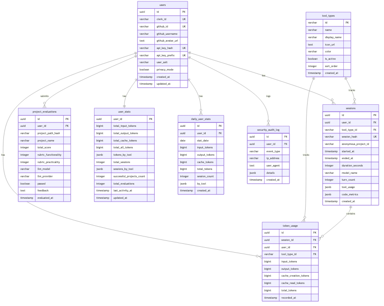

# Modu Platform Database Schema

## Overview

This document describes the complete database schema for the Modu Platform (모두의연구소). This is a fresh design optimized for multi-AI-tool token monitoring and project evaluation.

## ER Diagram



## Table Descriptions

### Core Tables

#### `users`
User accounts linked to GitHub via Clerk authentication.

| Column | Type | Description |
|--------|------|-------------|
| `id` | UUID | Primary key |
| `clerk_id` | VARCHAR(255) | Clerk authentication ID (unique) |
| `github_id` | VARCHAR(255) | GitHub user ID (unique) |
| `github_username` | VARCHAR(255) | GitHub username |
| `github_avatar_url` | TEXT | GitHub avatar URL |
| `api_key_hash` | VARCHAR(255) | Hashed API key for CLI authentication |
| `api_key_prefix` | VARCHAR(20) | API key prefix for identification |
| `user_salt` | VARCHAR(255) | User-specific salt for hashing |
| `privacy_mode` | BOOLEAN | Enable privacy mode |
| `created_at` | TIMESTAMP | Account creation time |
| `updated_at` | TIMESTAMP | Last update time |

#### `tool_types`
Registry of supported AI coding tools.

| Column | Type | Description |
|--------|------|-------------|
| `id` | VARCHAR(50) | Tool identifier (PK) |
| `name` | VARCHAR(100) | Internal tool name |
| `display_name` | VARCHAR(100) | Display name for UI |
| `icon_url` | TEXT | Tool icon URL |
| `color` | VARCHAR(7) | Hex color for UI |
| `is_active` | BOOLEAN | Whether tool is active |
| `sort_order` | INTEGER | Display order |
| `created_at` | TIMESTAMP | Registry entry time |

**Supported Tools:**
- `claude-code` - Anthropic Claude Code
- `claude-desktop` - Anthropic Claude Desktop
- `opencode` - OpenCode AI
- `gemini` - Google Gemini Code
- `codex` - OpenAI Codex
- `crush` - Crush AI

#### `sessions`
AI coding session records with tool type identification.

| Column | Type | Description |
|--------|------|-------------|
| `id` | UUID | Primary key |
| `user_id` | UUID | Foreign key to users |
| `tool_type_id` | VARCHAR(50) | Foreign key to tool_types |
| `session_hash` | VARCHAR(64) | SHA-256 hash for deduplication |
| `anonymous_project_id` | VARCHAR(100) | Anonymous project identifier |
| `started_at` | TIMESTAMP | Session start time |
| `ended_at` | TIMESTAMP | Session end time |
| `duration_seconds` | INTEGER | Session duration |
| `model_name` | VARCHAR(100) | AI model used |
| `turn_count` | INTEGER | Number of interactions |
| `tool_usage` | JSONB | Tool-specific usage data |
| `code_metrics` | JSONB | Lines added/deleted, files modified |
| `created_at` | TIMESTAMP | Record creation time |

#### `token_usage`
Normalized token consumption per session.

| Column | Type | Description |
|--------|------|-------------|
| `id` | UUID | Primary key |
| `session_id` | UUID | Foreign key to sessions |
| `user_id` | UUID | Foreign key to users |
| `tool_type_id` | VARCHAR(50) | Foreign key to tool_types |
| `input_tokens` | BIGINT | Input prompt tokens |
| `output_tokens` | BIGINT | Output response tokens |
| `cache_creation_tokens` | BIGINT | Cache write tokens |
| `cache_read_tokens` | BIGINT | Cache read tokens |
| `total_tokens` | BIGINT | **Computed**: sum of all tokens |
| `recorded_at` | TIMESTAMP | Record timestamp |

#### `project_evaluations`
LLM-based project evaluation results.

| Column | Type | Description |
|--------|------|-------------|
| `id` | UUID | Primary key |
| `user_id` | UUID | Foreign key to users |
| `project_path_hash` | VARCHAR(64) | SHA-256 hash of project path |
| `project_name` | VARCHAR(255) | Project name |
| `total_score` | INTEGER | Total score (0-10) |
| `rubric_functionality` | INTEGER | README compliance (0-5) |
| `rubric_practicality` | INTEGER | Practicality score (0-5) |
| `llm_model` | VARCHAR(100) | LLM model used |
| `llm_provider` | VARCHAR(50) | LLM provider |
| `passed` | BOOLEAN | Pass if score >= 5 |
| `feedback` | TEXT | LLM-generated feedback |
| `evaluated_at` | TIMESTAMP | Evaluation timestamp |

#### `user_stats`
Aggregated user statistics for dashboard performance.

| Column | Type | Description |
|--------|------|-------------|
| `user_id` | UUID | Primary key, foreign key to users |
| `total_input_tokens` | BIGINT | Total input tokens across all tools |
| `total_output_tokens` | BIGINT | Total output tokens across all tools |
| `total_cache_tokens` | BIGINT | Total cache tokens |
| `total_all_tokens` | BIGINT | Sum of all tokens |
| `tokens_by_tool` | JSONB | Token breakdown by tool |
| `total_sessions` | INTEGER | Total session count |
| `sessions_by_tool` | JSONB | Sessions by tool |
| `successful_projects_count` | INTEGER | Passed project evaluations |
| `total_evaluations` | INTEGER | Total evaluation attempts |
| `last_activity_at` | TIMESTAMP | Last activity timestamp |
| `updated_at` | TIMESTAMP | Stats update timestamp |

#### `daily_user_stats`
Daily aggregates for historical charts.

| Column | Type | Description |
|--------|------|-------------|
| `id` | UUID | Primary key |
| `user_id` | UUID | Foreign key to users |
| `stat_date` | DATE | Statistics date |
| `input_tokens` | BIGINT | Daily input tokens |
| `output_tokens` | BIGINT | Daily output tokens |
| `cache_tokens` | BIGINT | Daily cache tokens |
| `total_tokens` | BIGINT | Daily total tokens |
| `session_count` | INTEGER | Daily session count |
| `by_tool` | JSONB | Daily breakdown by tool |
| `created_at` | TIMESTAMP | Record creation time |

#### `security_audit_log`
Security event audit trail.

| Column | Type | Description |
|--------|------|-------------|
| `id` | UUID | Primary key |
| `user_id` | UUID | Foreign key to users (nullable) |
| `event_type` | VARCHAR(100) | Event type |
| `ip_address` | VARCHAR(45) | Client IP address |
| `user_agent` | TEXT | Client user agent |
| `details` | JSONB | Event details |
| `created_at` | TIMESTAMP | Event timestamp |

## Key Relationships

```
users (1) ──< (N) sessions
users (1) ──< (N) token_usage
users (1) ──< (N) project_evaluations
users (1) ──< (1) user_stats
users (1) ──< (N) daily_user_stats
users (1) ──< (N) security_audit_log

tool_types (1) ──< (N) sessions
tool_types (1) ──< (N) token_usage

sessions (1) ──< (N) token_usage
```

## Indexes

Performance-optimized indexes:

| Table | Index | Purpose |
|-------|-------|---------|
| `users` | `idx_users_clerk_id` | Fast Clerk lookup |
| `users` | `idx_users_api_prefix` | Fast API key lookup |
| `sessions` | `idx_sessions_user_id` | User session queries |
| `sessions` | `idx_sessions_started_at` | Time-based filtering |
| `token_usage` | `idx_token_usage_recorded_at` | Time-series queries |
| `project_evaluations` | `idx_evaluations_user_id` | User evaluation history |
| `user_stats` | `idx_user_stats_total_tokens` | Leaderboard queries |
| `user_stats` | `idx_user_stats_projects` | Project ranking |
| `daily_user_stats` | `idx_daily_user_stats_user_date` | Chart data queries |

## Design Principles

1. **Normalization**: Token usage separated from sessions for cleaner aggregation
2. **Performance**: `user_stats` table enables O(1) dashboard queries
3. **Privacy**: Project paths hashed, no code content stored
4. **Extensibility**: `tool_types` registry allows easy tool additions
5. **Time-series**: `daily_user_stats` supports historical analytics

## Migration Strategy

This schema is designed as a fresh installation. For existing Modu-Arena data:

1. Export existing user accounts and sessions
2. Transform data to new schema format
3. Import with default `tool_type_id = 'claude-code'`
4. Rebuild `user_stats` and `daily_user_stats` aggregates

---

**Last Updated**: 2026-02-15
**Schema Version**: 1.1.0
